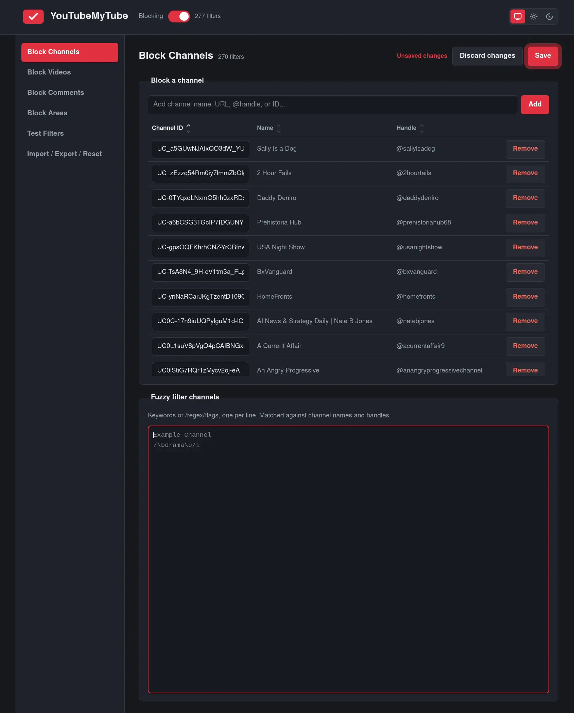

# YouTubeMyTube

Firefox extension that blocks YouTube videos, channels, users, Shorts, comments, etc..

[Install from AMO](https://addons.mozilla.org/en-GB/firefox/addon/youtubemytube/)



## Features

- Block channels by ID, handle or name.
- Block videos by ID or title.
- Block comments by author or content.
- Block content-areas: home feed, Shorts, Trending, Explore, Subscriptions, comments, live chat.
- Block/Unblock entries via YouTube `...` menus or Firefox toolbar popup.
- Import/export settings; supports BlockTube backups.
- Light/Dark/System theming.

## Privacy

YouTubeMyTube collects no personal data and sends nothing to the developer. Settings are stored locally and the only network requests go directly to YouTube to resolve public metadata. See [PRIVACY.md](PRIVACY.md).

---

## Architecture

This extension is focused on performance and resilience to YouTube UI changes. Manifest V3, DOM/CSS-first, with `declarativeNetRequest` for fast, direct navigation.

It does not depend on YouTube's internal renderer schemas or inject into the page's JavaScript; the browser does the blocking.

- **Lookups are constant-time.** IDs, handles and names are pre-compiled into sets and checked in one step, so performance doesn't degrade as the blocklist grows.
- **DOM work is batched.** Many page changes are collapsed into a single pass, already-processed nodes are skipped, and hiding is one CSS class rather than per-element style writes.
- **Matching is bounded.** Regex only runs on text fields, with input capped, so it can't be used as a performance footgun.
- **Writes are serialized.** A single service worker is the only writer, and redundant rule updates are diffed away.
- **Nothing touches YouTube's internals.** No page-level JavaScript injection or network interception, so there's no per-response parsing and less to break.

---

## Development

```sh
bun run build:firefox     # bundle dist/firefox (no archive)
bun run build             # bundle + store/source archives
bun run watch             # rebuild JS and copy static assets on change
bun run check             # Biome + typecheck + build:firefox + web-ext lint
bun run check:fix         # Biome lint + format, writing fixes
bun run lint:webext       # web-ext lint on dist/firefox
bun run test              # Vitest unit tests
bun run test:coverage     # Vitest with coverage report
bun run typecheck         # tsc --noEmit
bun run release           # cog bump --auto: tag + changelog, syncs package.json
```

`bun install` runs `prepare`, which installs the [Lefthook](https://lefthook.dev) git hooks. The `pre-commit` hook runs Biome on staged files and a full `tsc --noEmit`; the `commit-msg` hook enforces [Conventional Commits](https://www.conventionalcommits.org) via [Cocogitto](https://docs.cocogitto.io) (`cog`). Cocogitto is a system binary, not a Bun dependency — install it separately. Hooks are skipped automatically when there is no `.git` directory (for example when building from the submitted source archive).

### Building from source

The extension is built with esbuild via `esbuild.config.mjs`; the same build produces the store archives and the AMO review source archive.

Requirements: Node.js 26.8.2+ or Bun 1.4.2+. The build uses only Node built-ins and esbuild, so Linux, macOS and Windows are all supported. Dependencies are pinned in `bun.lock` (use `bun install --frozen-lockfile`); `npm install` resolves from `package.json`.

```sh
git clone https://github.com/dcog989/YouTubeMyTube
cd YouTubeMyTube
bun install --frozen-lockfile   # or npm install
npm run build:firefox           # node esbuild.config.mjs firefox
```

Output: the unpacked extension in `dist/firefox/` and the archive `dist/youtubemytube-firefox.zip`. `npm run build` additionally writes the AMO review source archive `dist/youtubemytube-source.zip`, packaged from git-tracked files (so it excludes `dist/`). The source archive contains the original TypeScript under `src/`; esbuild only bundles and minifies it into the shipped JavaScript, so no generated code is included.

Set `SOURCE_DATE_EPOCH` for byte-reproducible archives, e.g. `SOURCE_DATE_EPOCH=$(git log -1 --format=%ct) bun run build`. It only fixes the archive timestamps; the emitted JavaScript is deterministic without it.

### Continuous integration

`ci.yml` runs on pushes to `main` and on pull requests: frozen install, `check`, unit tests with coverage thresholds, build, `web-ext lint`, `bun audit`, and artifact upload.

### Release and publishing

`bun run release` (`cog bump --auto`) bumps `package.json` and creates the version tag. Pushing the tag triggers `release.yml`, which rebuilds the extension and attaches the archives to a GitHub Release.

AMO publishing (`web-ext sign --channel listed` using the `AMO_JWT_ISSUER` / `AMO_JWT_SECRET` repository secrets) is present but currently disabled in `release.yml` until those secrets are configured. AMO requires the add-on to already exist: register the `browser_specific_settings.gecko.id` from `manifests/firefox.json` first.

### Install

From AMO: <https://addons.mozilla.org/en-GB/firefox/addon/youtubemytube/>

Build and load unpacked:

```sh
bun install
bun run build
```

Firefox: `about:debugging#/runtime/this-firefox` → Load Temporary Add-on → `dist/firefox/manifest.json`.

---

## License

[GNU GPL-3.0](LICENSE).
